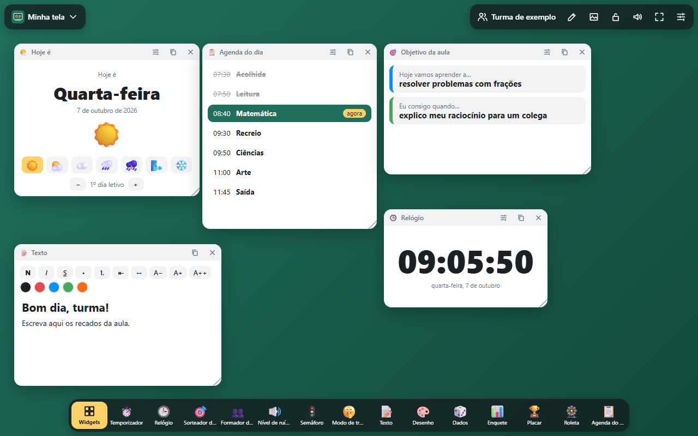

# Lousa

[](https://joaogabrielmontinirossi-sys.github.io/lousa/)

A tela da sala de aula. Um quadro para projetar na aula com 78 widgets que se arrastam, redimensionam e ficam salvos: temporizador, sorteador de nomes, formador de grupos, nível de ruído, semáforo, enquetes, placar, jogos, ferramentas de matemática e de linguagem e muito mais. Funciona no navegador, no celular e no Windows, com sincronização entre computadores pelo Google Drive.

Tudo roda no próprio aparelho: nenhum dado de aluno é enviado para servidores.

## Usar no navegador (site)

Abra **https://joaogabrielmontinirossi-sys.github.io/lousa/** e toque em **Widgets**, na barra de baixo.

## No celular

Abra o mesmo endereço no navegador do celular.

- **Android (Chrome)**: abra **Ajustes** (canto de cima, à direita) › **Instalar o aplicativo** (ou ⋮ › *Instalar app*). A Lousa ganha ícone na tela inicial e abre em tela cheia.
- **iPhone/iPad (Safari)**: toque em **Compartilhar** › **Adicionar à Tela de Início**.

Depois de aberta uma vez, funciona sem internet. As telas e turmas ficam guardadas no próprio aparelho; para levá-las ao computador (ou trazê-las de lá), use **Ajustes › Exportar backup** e **Importar…**.

## No Windows (.exe)

Pegue o `Lousa.exe` na página de [Releases](../../releases/latest) e abra. Não precisa instalar nada: o programa usa o Edge (ou o Chrome) que já está no Windows para mostrar a janela.

Como o arquivo não é assinado, o Windows pode mostrar o aviso do SmartScreen na primeira vez: clique em **Mais informações** e depois em **Executar assim mesmo**.

## Como funciona

- **Widgets**: o botão amarelo abre a galeria com busca. A estrela fixa o widget na barra de baixo.
- **Janelas**: arraste pelo título, redimensione pelo canto, use a engrenagem para configurar, o ícone de cópia para duplicar e o X para fechar (dá para desfazer).
- **Telas**: o botão com o nome da tela (em cima, à esquerda) cria, renomeia, duplica e troca de tela. Há telas prontas: *Início da aula*, *Trabalho em grupo*, *Dia de prova*, *Pausa ativa*, *Hora do jogo*, *Aula de matemática* e *Roda de leitura*.
- **Turmas**: listas de nomes usadas pelo sorteador, grupos, chamada, pontos, mapa de lugares e os demais widgets de nomes. Dá para importar de um arquivo `.txt` ou `.csv`.
- **Fundo**: cores, degradês, papel pautado ou quadriculado, ou uma imagem sua.
- **Anotar**: o lápis desenha por cima de tudo, como numa lousa digital.
- **Travar**: o cadeado impede que os widgets saiam do lugar durante a aula.
- Arraste uma imagem para a janela para colocá-la na tela.

## Os widgets

### Essenciais (27)

| Grupo | Widgets |
| --- | --- |
| Tempo | Relógio, Temporizador, Cronômetro, Contagem para evento, Calendário, Horário semanal |
| Sorteios | Sorteador de nomes, Dados, Formador de grupos, Mapa de lugares |
| Turma | Nível de ruído (microfone), Semáforo, Modo de trabalho, Enquete, Placar, Lista de tarefas |
| Mídia e quadro | Texto, Desenho, Imagem, Vídeo (YouTube, Vimeo ou arquivo), Câmera, Código QR, Incorporar site, Link, Adesivo |
| Jogos | Jogo da velha, Forca |

### Extras (51)

| Grupo | Widgets |
| --- | --- |
| Tempo | Pomodoro, Ampulheta, Rotação de estações, Metrônomo, Hoje é, Modo prova |
| Sorteios | Roleta, Cara ou coroa, Número aleatório, Letra aleatória, Ordem de apresentação, Pedra-papel-tesoura, Bingo, Ajudantes do dia |
| Turma | Chamada, Pontos por aluno, Nível de voz, Meta da turma, Passe de saída, Fila de ajuda, Contador, Agenda do dia, Objetivo da aula, Aniversariantes, Letreiro, Como estou hoje, Bilhete de saída, Respiração guiada, Pausa ativa |
| Matemática | Calculadora, Reta numérica, Frações, Tabuada, Cálculo mental, Quadro de cem, Relógio de aprender, Conversor de medidas, Dinheiro, Gráfico rápido |
| Linguagem | Palavra do dia, Palavra embaralhada, Caça-palavras, Leitor em voz alta, Dados de história, Flashcards, Cartões de conversa |
| Jogos e música | Piano, Jogo da memória, Quiz |
| Mídia e quadro | Cortina, Post-it |

## Sincronização

Funciona como no [Prisma](https://github.com/joaogabrielmontinirossi-sys/prisma), no [Ishikawa](https://github.com/joaogabrielmontinirossi-sys/ishikawa) e no [Capynote](https://github.com/joaogabrielmontinirossi-sys/capynote): a Lousa para Windows grava o arquivo `lousa-sync.json` numa pasta do Google Drive para computador (`Meu Drive\Lousa`) a cada alteração, e o Drive o leva aos outros aparelhos. Outro computador com a Lousa e o mesmo Drive recebe as telas e turmas automaticamente.

- Se o Google Drive para computador estiver instalado, a sincronização já começa ligada.
- Em **Ajustes** dá para desativar, trocar de conta (cada unidade G:, H:… é uma conta) ou escolher qualquer outra pasta sincronizada (OneDrive, Dropbox…).
- Alterações feitas em dois computadores são mescladas por tela e por turma: vale a versão mais recente de cada uma, e exclusões também são propagadas.

Sem sincronização, os dados ficam só neste computador (em `%LOCALAPPDATA%\Lousa`). Use **Ajustes › Exportar backup** para levar tudo a outro lugar.

A cada alteração na pasta `app/` da branch `main`, o GitHub Actions publica a versão web automaticamente (`.github/workflows/web.yml`).

## Bom saber

- Microfone (nível de ruído) e câmera pedem permissão ao navegador na primeira vez.
- Alguns sites não permitem ser incorporados; nesses casos use o widget **Link**.
- O código QR aceita até 271 caracteres.
- A interface está em português do Brasil.

## Compilar

Só precisa do Windows (usa o compilador C# do .NET Framework e o Edge, que já vêm instalados):

```powershell
powershell -ExecutionPolicy Bypass -File .\build.ps1
```

Gera `dist\Lousa.exe` e `dist\lousa.html` (versão em arquivo único, que abre em qualquer navegador; nela a sincronização automática não está disponível, apenas o backup).

| Pasta | Conteúdo |
| --- | --- |
| `app/` | O aplicativo (HTML, CSS e JavaScript puros, sem dependências) |
| `app/core.js` | Janelas dos widgets, peças compartilhadas e o gerador de código QR |
| `app/w-base.js` | Widgets essenciais |
| `app/w-extra1.js`, `app/w-extra2.js` | Widgets extras |
| `app/app.js` | Barra, galeria, telas, turmas, fundo, anotação, backup e sincronização |
| `desktop/Lousa.cs` | Programa de Windows: serve o app em `localhost` e grava a pasta de sincronização |
| `build.ps1` | Gera os ícones, compila o `.exe` e monta o arquivo único |

## Licença

[MIT](LICENSE): pode usar, copiar, modificar e distribuir livremente, mantendo o aviso de autoria.
